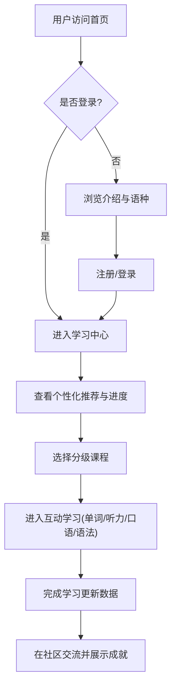

## 1. 产品概述
这款产品是一个支持多语种（如英语、日语、韩语等）的在线沉浸式语言学习平台。
旨在通过分级课程、互动练习、进度追踪和社区互动，为用户提供一站式、个性化的外语学习体验。

## 2. 核心功能

### 2.1 用户角色
| 角色 | 注册方式 | 核心权限 |
|------|---------------------|------------------|
| 游客 | 无 | 浏览平台介绍、查看热门课程 |
| 学习者 | 邮箱/账号注册 | 学习分级课程、使用互动学习模块、参与社区交流、查看学习进度 |

### 2.2 功能模块
1. **首页**: 英雄区域、语种选择、平台特色展示
2. **学习中心**: 课程列表、个性化路径推荐、学习进度仪表盘
3. **互动学习区**: 单词记忆、语法练习、口语跟读、听力训练
4. **社区与成就**: 用户论坛、成就徽章系统、学习排行榜

### 2.3 页面详情
| 页面名称 | 模块名称 | 功能描述 |
|-----------|-------------|---------------------|
| 首页 | 英雄区域 | 展示引人注目的标语、动态语种切换动画及行动号召按钮 |
| 学习中心 | 进度看板 | 可视化图表展示当前学习进度，推荐下一步学习计划 |
| 互动学习区| 单词卡片 | 支持3D翻转的单词记忆卡片，包含发音和例句 |
| 互动学习区| 听力/口语练习 | 提供音频播放器及录音跟读反馈模块 |
| 社区交流 | 论坛与成就 | 展示用户的学习徽章、发帖交流学习经验 |

## 3. 核心流程

## 4. 界面设计
### 4.1 设计风格
- **主色调**：深邃的科技蓝与活力橙，传达专业且活泼的学习氛围。
- **排版字体**：清晰的无衬线字体（如 Inter 或 系统默认中文字体），保证多语种字符的完美展示。
- **组件风格**：卡片式布局，大圆角设计，配以柔和的阴影和微渐变。
- **动效设计**：流畅的页面过渡，互动学习时（如答对、翻卡）提供积极的微交互反馈。

### 4.2 页面设计概览
| 页面名称 | 模块名称 | UI 元素 |
|-----------|-------------|-------------|
| 首页 | 英雄区域 | 沉浸式背景、大号加粗字体、渐变主按钮 |
| 学习中心 | 进度仪表盘 | 环形进度条、活跃度热力图、统计数据卡片 |
| 互动学习区| 互动卡片 | 3D翻转动画、进度指示器、音频控制图标 |

### 4.3 响应式设计
优先桌面端大屏沉浸式体验（支持复杂的仪表盘和分屏互动），同时完美自适应平板及移动设备，小屏幕下采用底部导航与单列流式布局。
