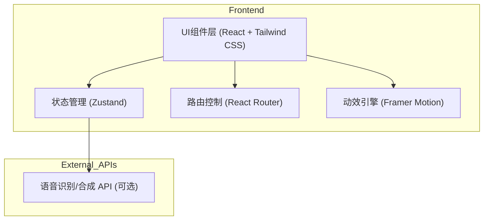

## 1. 架构设计

## 2. 技术说明
- **前端框架**: React@18 + tailwindcss@3 + vite
- **路由管理**: react-router-dom
- **状态管理**: zustand (用于存储用户登录态、学习进度及配置)
- **动效与交互**: framer-motion (实现沉浸式过渡及卡片翻转等动效)
- **图标与图形**: lucide-react (矢量图标) + recharts (学习数据可视化)
- **代码规范**: TypeScript 强类型支持

## 3. 路由定义
| 路由 | 目的 |
|-------|---------|
| `/` | 平台首页展示 |
| `/login` | 用户注册与登录 |
| `/dashboard` | 学习中心仪表盘、进度及个性化推荐 |
| `/course/:id` | 课程大纲及详情 |
| `/learn/:type` | 互动学习模块 (type可为 vocab, grammar, speaking, listening) |
| `/community` | 社区交流与成就榜单 |

## 4. API 定义 (前端 Mock 数据结构)
由于当前重点为前端体验，使用 Mock 数据模拟核心接口交互：
- `UserProgress`: `{ userId: string, level: number, exp: number, completedModules: string[] }`
- `CourseData`: `{ id: string, language: string, title: string, modules: Module[] }`
- `VocabCard`: `{ word: string, translation: string, audioUrl: string, example: string }`

## 5. 数据流向说明
1. **认证与加载**：用户登录后，状态管理加载 Mock 数据，初始化 `UserProgress`。
2. **仪表盘渲染**：读取状态中的数据，通过 `recharts` 渲染图表。
3. **互动学习流**：进入 `/learn` 路由后，加载具体的课程内容（如 `VocabCard`），用户交互操作（如答对、完成录音）后触发状态更新，重新计算经验值和进度。
